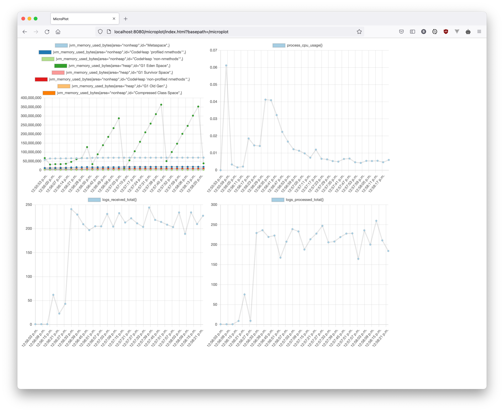

# Microplot

Microplot is a small library to plot Micrometer metrics for your Spring Boot projects. It is intended to be used during development.

Add it to your project dependencies:
```xml
<dependency>
    <groupId>com.taypo</groupId>
    <artifactId>microplot</artifactId>
    <version>1.0.0</version>
</dependency>
```

Simply state what metrics you need to be stored and plotted in your `application.properties` file:
```properties
management.endpoints.web.exposure.include=*
microplot.include-metrics=jvm.memory.used,process.cpu.usage,logs.received,logs.processed
```
And point your browser to `http://localhost:8080/microplot/`:



## Configuration

| Property                   | Description                                                   | Default    |
|----------------------------|---------------------------------------------------------------|------------|
| microplot.include-metrics  | Comma seperated list of metric names to plot                  |            |
| microplot.uri-path         | Change the path where the plots will be exposed               | /microplot |
| microplot.keep-records-max | Maximum number of metric points to store                      | 100        |
| microplot.period           | Specify how frequent to check and store metrics (miliseconds) | 5000       |


## Dependencies
- Spring Web MVC
- Actuator and Micrometer
- Your project should contain `@EnableScheduling` annotation.
- Apache Commons Lang and Collections

## What's New

### 1.0.0 (04.12.2021)

- First release. Hurray!
- Gauge and Counter metrics supported.
- Counters are plotted as rate per second.
